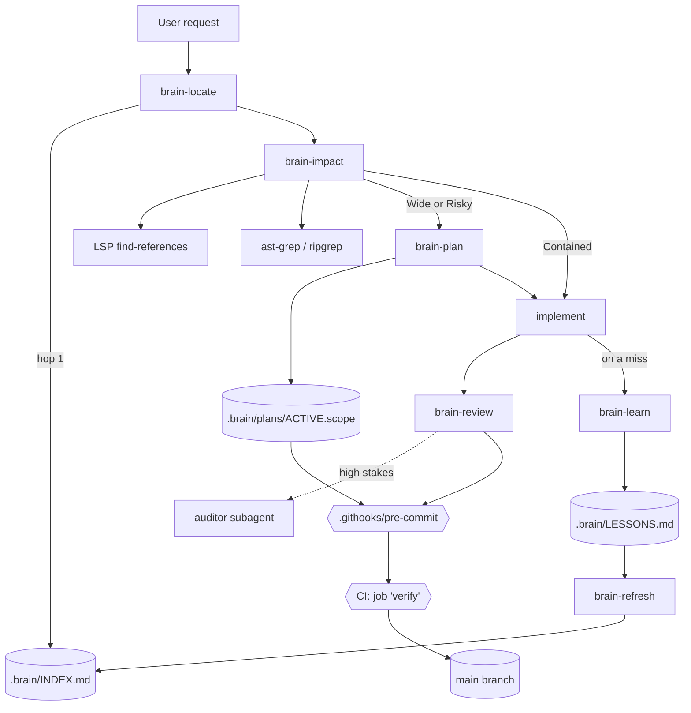
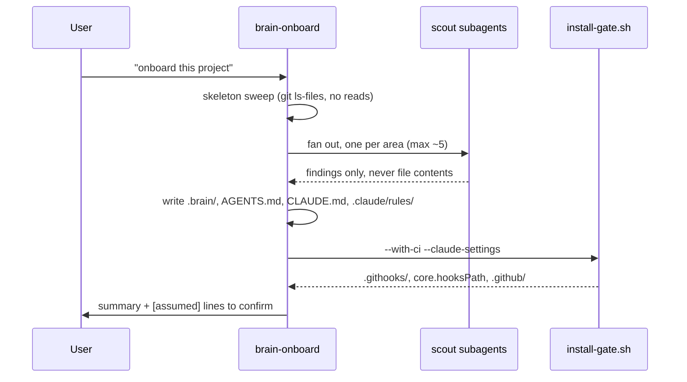
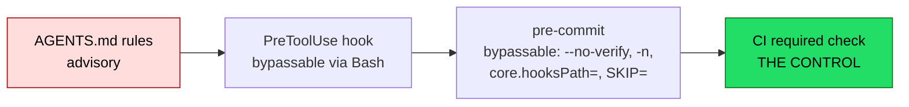
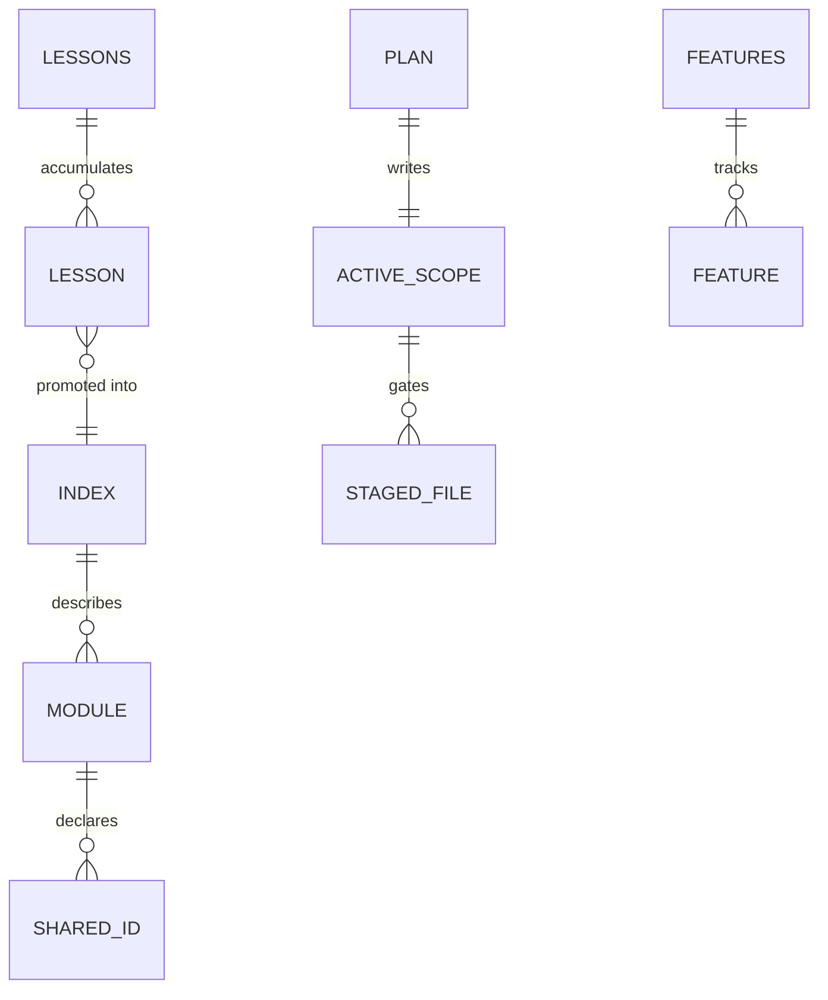

# ARCHITECTURE

## System map

## Onboarding sequence

## Enforcement layers

Strength increases left to right. Layers A–C are all bypassable by an agent that chooses
to; only D survives, and only once marked **required** in branch protection.

## Data model — what lives where

`.brain/` is committed on purpose — the diffs get reviewed like code, which is the stated
mitigation for memory poisoning (OWASP ASI06).

## Runtime shape

No server, no daemon, no build. Three execution contexts:

| Context | Trigger | Runs |
|---|---|---|
| Claude Code session | `SessionStart` | `hooks/session-start.sh` — prints a pointer + freshness warning |
| Claude Code edit | `PostToolUse` on Edit/Write | `hooks/mark-stale.sh` — appends to `.brain/.stale` |
| git | `pre-commit`, `pre-merge-commit` | scope + debris checks |
| GitHub Actions | push / PR to `main` | job `verify` |

## External dependencies

`git`, `python3`, `bash`. Optional: `rg`, `ast-grep`, `ctags`, `jq`, the `claude` CLI, an
LSP plugin. **Undeclared:** `pyyaml`, required by `selftest.sh`'s YAML check.

## Failure modes

| Failure | How it shows | Recovery |
|---|---|---|
| INDEX goes stale | session-start warns "N commits behind" | `brain-refresh` |
| Gate absent after clone | commits pass that should not | re-run `install-gate.sh`; `core.hooksPath` is per-clone |
| Scope unenforced | gate prints "Scope not enforced" | expected without an ACTIVE.scope — the default state |
| CI never required | red checks merge anyway | mark job `verify` required in branch protection |
| Template/installed drift | live gate runs old logic | no detection exists — compare by hand |
| Dynamic identifiers | impact analysis under-reports | INDEX "Dynamic references" makes the gap visible, not closed |
