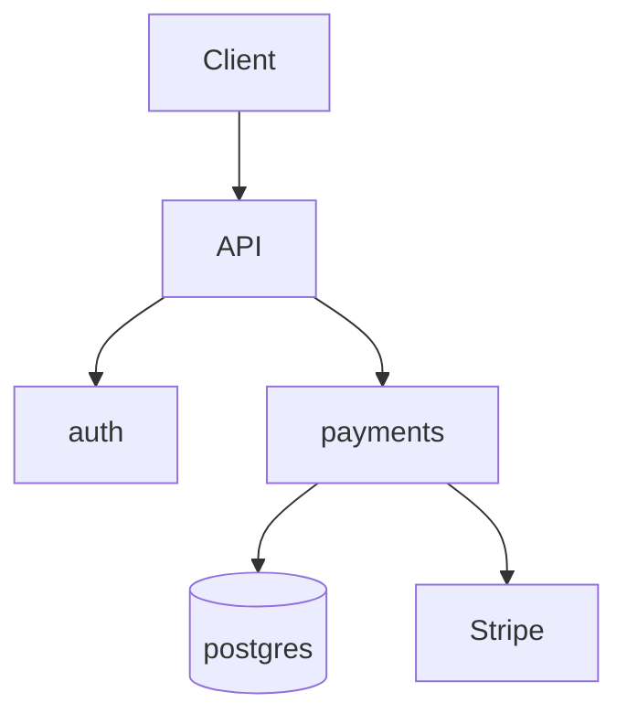
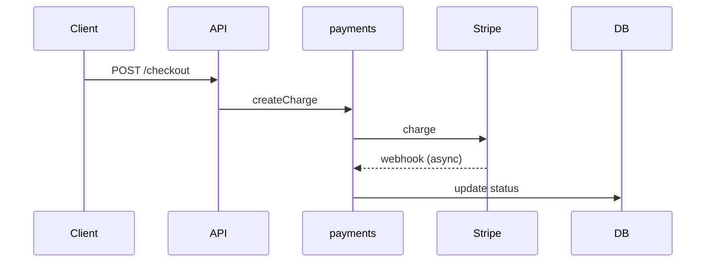
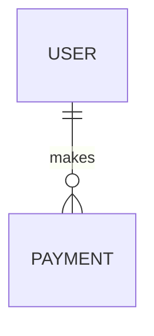

# Onboard a project into the brain

Goal: after this runs, any future session can answer "where do I change X, and what else does that break" by reading one file, without re-scanning the codebase.

Budget: this is a **survey, not a read-through**. Onboarding a 50k-line repo should cost tens of thousands of tokens, not hundreds of thousands. If you find yourself reading files in full, stop — you are doing it wrong.

## Hard rules for this skill

- Never `Read` a source file in full unless it is under 200 lines AND you have a specific reason.
- Prefer, in order: `ast-grep outline` → `ctags` → `rg` for declarations → `head -60`.
- Fan out through the **scout** subagent. Scout reads; you receive findings. This is what keeps the main context clean.
- Everything you write into `.brain/` must be *verifiable*. No inferred detail you did not actually check. A wrong index is worse than no index, because future sessions will trust it.
- Record **gotchas, not descriptions**. "auth.ts handles auth" is worthless. "auth.ts refresh path assumes UTC; the mobile client sends local time — this has caused two outages" is the whole point.

## Step 0 — Preflight

```bash
pwd && git rev-parse --is-inside-work-tree 2>/dev/null
ls -a
cat package.json go.mod pyproject.toml Cargo.toml composer.json pom.xml build.gradle 2>/dev/null | head -80
git log --oneline -20
```

Detect the stack from manifests. Then check which structural tools exist:

```bash
for t in ast-grep rg ctags jq; do command -v $t >/dev/null && echo "have: $t"; done
```

Report to the user which language-intelligence plugin they should install, once, e.g.
`/plugin install typescript-lsp@claude-plugins-official` (or `pyright-lsp`, `gopls-lsp`, `rust-analyzer-lsp`, `clangd-lsp`, `jdtls-lsp`, `csharp-lsp`, `php-lsp`, `swift-lsp`, `kotlin-lsp`, `lua-lsp`).
Do not block on it. Note it in `.brain/DECISIONS.md` under Tooling.

If this is **not** a git repo, say so plainly: the scope gate cannot be installed, and enforcement drops to advisory. Offer `git init`.

## Step 1 — Skeleton sweep (cheap, no file reads)

```bash
git ls-files | wc -l
git ls-files | sed 's|/[^/]*$||' | sort | uniq -c | sort -rn | head -40
git ls-files | awk -F. 'NF>1{print $NF}' | sort | uniq -c | sort -rn | head -15
```

That gives you the shape of the repo in three commands. Identify:

- entrypoints (`main`, `index`, `app`, `server`, `cmd/`, `__main__`)
- routes / pages / screens
- data layer (models, schema, migrations)
- shared/util/common directories — **these matter most**, they are where cross-cutting breakage lives
- config, env, feature flags
- tests, and how they run

## Step 2 — Symbol surface (still no full reads)

If `ast-grep` is available:
```bash
ast-grep outline <dir> --items all --view signatures
```
Else if `ctags`:
```bash
ctags -R --fields=+neKz -f - <dir> | head -400
```
Else fall back to ripgrep for declarations, e.g.
```bash
rg -n '^\s*(export |public |func |def |class |type |interface )' --glob '!**/{node_modules,dist,build,vendor,.venv}/**' | head -400
```

## Step 3 — Fan out with scout

Launch **scout** subagents in parallel, one per major area (max ~5 concurrent). Give each a narrow brief:

> Area: `src/payments`. Report: what this module is responsible for, its public surface (exported functions/classes/routes with signatures), what it imports from elsewhere in the repo, what imports it, any hardcoded strings/keys/flags that appear to be shared, and any landmine you noticed (dead code, duplicated logic, TODO/FIXME/HACK, error swallowing). Do not paste file contents. Max 400 words.

Scout returns findings. You never see the files.

## Step 4 — Write `.brain/INDEX.md`

This is the single most important artifact. Format, one row per module:

```markdown
# INDEX

> Read this before opening any source file. If it's wrong, fix it — do not route around it.
> Last verified: <ISO date> against commit <sha>

## Modules

### payments
- **Path:** `src/payments/`
- **Owns:** charge creation, refunds, webhook ingestion
- **Entry:** `src/payments/index.ts`
- **Public surface:** `createCharge(input)`, `refund(chargeId, amount?)`, `handleWebhook(req)`
- **Depends on:** `db`, `lib/money`, Stripe SDK
- **Used by:** `api/routes/checkout.ts`, `jobs/reconcile.ts`, `admin/refund-panel.tsx`
- **Shared identifiers:** `PAYMENT_STATUS` enum (also referenced in DB column `payments.status` and in `i18n/en.json`)
- **Gotchas:** amounts are integer minor units everywhere except the admin panel, which formats to decimal on read

...
```

**"Used by" and "Shared identifiers" are the fields that stop things breaking.** Populate them properly. If you cannot verify a "used by" edge, mark it `(unverified)`.

Finish with a quick-lookup table:

```markdown
## Where do I change...

| I want to change | Go to | Also check |
|---|---|---|
| the checkout button label | `web/components/CheckoutButton.tsx` | `i18n/*.json`, snapshot tests |
| refund rules | `src/payments/refund.ts` | `admin/refund-panel.tsx`, `docs/policy.md` |
```

This table is what makes "change the text on that button" a one-hop operation instead of a repo crawl. Build it from the real user-facing surface, not guesses.

## Step 5 — Write `.brain/ARCHITECTURE.md`

Prose is secondary; the diagrams are the payload. Include at minimum:

````markdown
## System map


## Request lifecycle: checkout


## Data model

````

Then: deployment/runtime shape, environments, external dependencies, and the **failure modes** section — what breaks, how it is noticed, what the recovery is.

## Step 6 — Write `.brain/PRD.md`

Reverse-engineer, do not invent. Sources: README, docs, route names, UI copy, tests, git history, issue templates.

Sections: Problem being solved · Who uses it · Core user journeys (numbered, concrete) · Feature inventory grouped by area · Explicit non-goals (things the code deliberately doesn't do) · Open questions.

Mark every uncertain claim `[assumed]`. Then **ask the user to correct the assumed lines** — this is the highest-value five minutes in the whole onboarding, because it converts your guesses into ground truth that persists forever.

## Step 7 — Write `.brain/DECISIONS.md` and `.brain/GLOSSARY.md`

`DECISIONS.md`: one entry per non-obvious choice — what, why, what it constrains, what would break if reversed. Mine `git log` for reverts and "fix:" commits; those are where the landmines are buried.

`GLOSSARY.md`: project vocabulary, internal shorthand, acronyms, service codenames, table nicknames. So that later, when the user says something in shorthand, you resolve it instead of asking.

## Step 8 — Write `.brain/features.json`

```json
{
  "features": [
    {
      "id": "checkout-basic",
      "area": "payments",
      "description": "A logged-in user can complete a checkout with a saved card",
      "verify": "npm test -- checkout",
      "passes": false
    }
  ]
}
```

Rules, stated in the file itself: an agent may only flip `passes` from `false` to `true`, and only after actually running `verify` and seeing it pass. Never edit `description`. Never delete an entry. JSON is used deliberately — models overwrite markdown far more readily than JSON.

## Step 9 — Write `AGENTS.md` (hard cap: ~150 lines) and the `CLAUDE.md` bridge

**`AGENTS.md` is the single source of truth.** It is read natively by Codex, Cursor, Windsurf/Devin, Cline, opencode, Amp, Zed, Warp, Copilot, Jules and Factory. Use `templates/AGENTS.md.tpl`.

It must contain: what the repo is in three lines, the pointer to `.brain/INDEX.md`, the operating loop, the surgical-changes block, the scope rule, the do-not-circumvent-enforcement rule, the real commands, and the top gotchas. Nothing else. No directory descriptions — that is INDEX's job, and INDEX loads on demand. If you catch yourself adding a section "for completeness", delete it.

Then `CLAUDE.md` — **Claude Code does not read `AGENTS.md`**, so bridge it:

```markdown
@AGENTS.md

## Claude Code specifics
<...only the Claude-only additions...>
```

Never duplicate content between the two. Use `templates/CLAUDE.md.tpl`.

Keep it tight: Codex caps the combined instruction chain at 32 KiB, and `@`-imports are expanded into context at launch, so they do not save tokens.

## Step 10 — Write `.claude/rules/*.md`

One file per domain, each path-scoped so it costs nothing until relevant:

```markdown
---
globs: "src/payments/**, **/*payment*"
---
- Money is integer minor units. Never float. Never `parseFloat` on an amount.
- Every mutation of payment state goes through `payments/state.ts`. Never write `payments.status` directly.
- Stripe webhook handlers must be idempotent; the same event id will arrive more than once.
```

**Use `globs:` with a comma-separated unquoted-pattern string.** The documented `paths:` key with YAML list syntax is known not to parse — a rule written that way silently never loads.

Derive these from what you actually observed. Generic best practice is noise; project-specific landmines are the product.

## Step 11 — Install the enforcement layers

```bash
bash "<plugin-root>/bin/install-gate.sh" --with-ci --claude-settings
```

That installs `.githooks/pre-commit` and `.githooks/pre-merge-commit`, sets `core.hooksPath=.githooks` so the hooks are version-controlled and survive a fresh clone, and drops a `brain-verify` CI workflow.

**Then tell the user the truth about the layers, in order of strength:**

1. `AGENTS.md` / `CLAUDE.md` rules — advisory. Agents follow them most of the time.
2. `.githooks/pre-commit` — blocks local commits. Bypassable with `--no-verify`, `-n`, `git -c core.hooksPath=…`, or `SKIP=`. Does not fire on rebase or cherry-pick. Cannot exist for commits created through a hosting API or a web-UI squash merge.
3. **The CI required status check — the only layer that survives all of the above.** Installing the workflow is not enough; they must mark `brain-verify` as required in branch protection or a ruleset. Say this explicitly. It is the single most important sentence in the whole onboarding.

Do not overstate layer 2. Presenting a bypassable hook as a guarantee is worse than having no hook, because it buys false confidence.

## Step 12 — Verify (do not skip)

1. Pick **five random entries** from INDEX.md and check them against reality (`rg` the symbol, confirm the "used by" edges resolve). Fix anything wrong.
2. Run the project's build and test commands. Record the exact commands in `AGENTS.md`.
3. Confirm `.brain/` files exist and are non-empty, and that `features.json` parses.
4. **Prove the gate blocks.** Write a throwaway file outside the scope list, stage it, attempt a commit, confirm it is rejected, then unstage. A gate you did not watch reject something is not known to work.
5. Confirm `git config core.hooksPath` returns `.githooks`.
6. Report honest coverage: which areas are well mapped, which are `(unverified)`, what you could not determine, and whether the CI check still needs to be marked required.

## Output to the user

A short summary: repo shape, what was written, the top three landmines found, the LSP plugin to install, and the list of `[assumed]` PRD lines you need them to confirm. Do not paste the artifacts back — they can open them.
